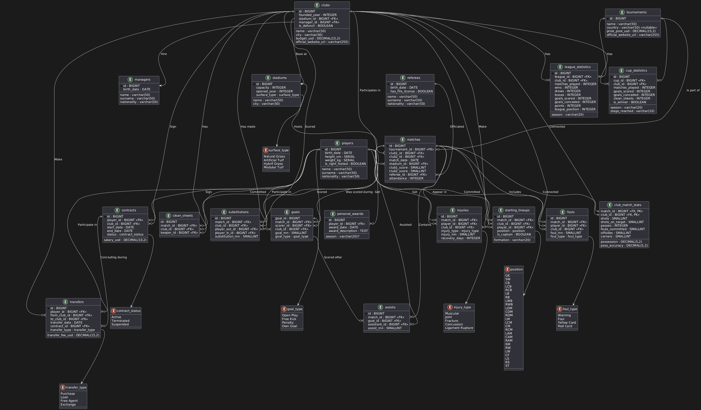

# Сервис для сбора футбольной статистики

## Функциональные требования

Проектируемая база данных представляет собой комплексное хранилище информации о футболе, охватывающее широкий спектр данных, связанных с командами, игроками, тренерами, матчами и статистическими показателями. Она включает в себя следующие ключевые сущности:

- **Игроки, тренеры, судьи** – информация о персоналиях, включая возраст, национальность и другие характеристики.
- **Клубы и стадионы** – данные о футбольных клубах, их домашнем стадионе, бюджете и тренерах.
- **Турниры и матчи** – сведения о турнирах, матчах, их участниках, стадионах, судьях и результатах.
- **Статистика матчей** – данные по владению мячом, ударам, передачам, фолам и другим игровым параметрам.
- **Голы и голевые передачи** – информация о забитых мячах, их авторах, ассистентах и времени забитых голов.
- **Карточки и нарушения** – фиксация дисциплинарных наказаний (желтые и красные карточки).
- **Замены и травмы** – учет замен игроков и их травм, с деталями о типах повреждений и сроках восстановления.
- **Контракты и трансферы** – отслеживание истории переходов игроков между клубами и условий их контрактов.
- **Персональные награды** – хранение данных о достижениях игроков и тренеров.

Система позволяет получать различные виды статистики:

- Результаты матчей, анализ забитых голов и ассистов.
- Дисциплинарные показатели (карточки, фолы).
- Производительность команд (удары, владение мячом, передачи).
- Анализ игроков (лучшие бомбардиры, ассистенты, травмы, успешность замен).
- История турниров и команд, динамика их успехов.
- Анализ трансферной активности и финансовых показателей клубов.

Эта база данных предоставляет исчерпывающий инструментарий для глубокого анализа футбольных событий, что делает ее полезной для аналитиков, тренеров, спортивных журналистов и любителей футбола.

### Отношения
- Игроки 
- Тренеры
- Судьи
- Клубы
- Стадионы
- Турниры
- Трансферы
- Контракты
- Матчи
- Статистика команд в матчах
- Голы
- Голевые передачи
- Нарушения
- Сухие матчи
- Замены
- Травмы
- Стартовые составы
- Персональные награды
- Статистика кубков
- Статистика лиг


### Разберем каждое отношение по отдельности

### Таблица "Игроки"
|Атрибут|Тип данных|Описание|
|-------|----------|--------|
|`player_id`|`BIGINT PRIMARY KEY`| Уникальный идентификатор игрока|
| `name` |` VARCHAR(50) NOT NULL `| Имя игрока
| `surname` | `VARCHAR(50) NOT NULL` | Фамилия игрока
| `birth_date` | `DATE NOT NULL` | Дата рождения игрока
| `nationality` | `VARCHAR(50) NOT NULL` | Национальность игрока
| `height_sm` |  `SERIAL NOT NULL` | Рост игрока в сантиметрах |
| `weight_kg` | `SERIAL NOT NULL` | Вес игрока в килограммах|
| `is_right_footed` | `BOOLEAN` | Является ли правая нога рабочей

В данной таблице находятся все футбольные игроки и основная информация про них, которая включает в себя имя, фамилию, рост, вес, дату рождения, национальность и рабочую ногу игрока. В эту таблицу можно только добавлять новых игроков.

### Таблица "Стадионы"

|Атрибут|Тип данных|Описание|
|---------|----------|---------|
|`stadium_id`|`BIGINT PRIMARY KEY`|Уникальный идентификатор стадиона |
|`name`|`VARCHAR(50) NOT NULL`| Название стадиона |
|`city`|`VARCHAR(50) NOT NULL`| Город, в котором расположен стадион |
|`capacity`|`INTEGER  NOT NULL`| Максимальное количество зрителей |
|`opened_year`|`INTEGER NOT NULL`| Год открытия стадиона |
|`surface_type`|`SurfaceType NOT NULL`| Тип покрытия (трава, искусственное покрытие и т. д.) 

Эта таблица хранит информацию о футбольных стадионах, где проводятся матчи. Она содержит ключевые характеристики стадионов, такие как название, вместимость, тип покрытия. Вынес тип атрибута "Тип покрытия" в `ENUM`:
```sql
CREATE TYPE SurfaceType AS ENUM ('Natural Grass', 'Artificial Turf', 'Hybrid Grass');
```
Так как индексация значений энама работает быстрее чем `VARCHAR` и энам экономнее по памяти.
В эту таблицу можно добавлять новые стадионы, а также изменять значения некоторых атрибутов (название стадиона, вместимость и тип покрытыя). Дату изменения не храним

### Таблица "Клубы"
| Атрибут          | Тип данных      | Описание |
|-----------------|---------------|----------|
| `team_id`       | `BIGINT` (PK)  | Уникальный идентификатор клуба |
| `name`          | `VARCHAR(100)` | Название клуба 
| `city` | `VARCHAR(50)` | Город, где зарегистрирован клуб
| `founded_year`  | `INTEGER`          | Год основания клуба |
| `stadium_id`    | `BIGINT` (FK)     | Идентификатор домашнего стадиона |
| `manager_id`      | `BIGINT` (FK)     | Идентификатор главного тренера |
| `budget_usd`        | `DECIMAL(15,2)`| Бюджет клуба в долларах |
| `official_website_url` | `VARCHAR(255)` | Официальный сайт клуба |
| `is_defunct` | `BOOLEAN` | Является ли клуб упраздненным |

Эта таблица хранит информацию о футбольных клубах, участвующих в соревнованиях. Она включает ключевые характеристики клубов, такие как название, город, год основания, стадион, тренер, а также бюджет и ссылка на официальный сайт клуба.

### Таблица "Тренеры"
|Атрибут|Тип данных|Описание|
|-------|----------|--------|
| `manager_id` | `BIGINT PRIMARY KEY`| Уникальный идентификатор тренера|
| `name`|`VARCHAR(50) NOT NULL`| Имя тренера|
| `surname`|`VARCHAR(50) NOT NULL`|Фамилия тренера|
| `nationality`|`VARCHAR(50) NOT NULL`| Национальность тренера|
|`birth_date`|`DATE NOT NULL`| Дата рождения тренера|

В данной таблице находится информация про футбольных тренеров. А именно: имя, фамилия, национальность и дата рождения.

### Таблица: "Судьи"
| Атрибут          | Тип данных      | Описание |
|-----------------|---------------|----------|
| `referee_id`    | `BIGINT` (PK)  | Уникальный идентификатор судьи |
| `first_name`    | `VARCHAR(50)`  | Имя судьи |
| `last_name`     | `VARCHAR(50)`  | Фамилия судьи |
| `birth_date`    | `DATE`         | Дата рождения |
| `nationality`   | `VARCHAR(50)`  | Гражданство судьи |
| `has_fifa_license`    | `BOOLEAN`      | Есть ли у судьи лицензия FIFA |

Эта таблица хранит информацию о футбольных судьях, которые обслуживают матчи. Она включает основные характеристики судей, такие как имя, национальность, дату рождения и наличие у судьи лицензии FIFA.

### Таблица "Турниры"

| Атрибут          | Тип данных      | Описание |
|-----------------|---------------|----------|
| `tournament_id` | `BIGINT` (PK)  | Уникальный идентификатор турнира |
| `name`          | `VARCHAR(100)` | Название турнира |
| `country`       | `VARCHAR(50)`  | Страна, где проводится турнир (если международный — NULL) |
| `prize_pool_usd`    | `DECIMAL(15,2)`| Общий призовой фонд турнира в долларах |
| `official_website_url` | `VARCHAR(255)` | Официальный сайт турнира |

Эта таблица хранит информацию о футбольных турнирах, в которых участвуют клубы. Она включает ключевые характеристики турниров, такие как название, страна проведения, призовой фонд и официальный сайт турнира.

### Таблица "Матчи"
| Атрибут               | Тип данных         | Описание |
|-----------------------|-------------------|----------|
| `match_id`           | `BIGINT PRIMARY KEY` | Уникальный идентификатор матча |
| `tournament_id`      | `BIGINT`          | ID турнира, в рамках которого проходит матч (FK на `Турниры`) |
| `team1_id`       | `BIGINT`          | ID первой команды (FK на `Команды`) |
| `team2_id`       | `BIGINT`          | ID второй команды (FK на `Команды`) |
| `match_date`         | `DATE`             | Дата проведения матча |
| `stadium_id`         | `BIGINT`          | ID стадиона, где проходит матч (FK на `Стадионы`) |
| `team1_score`         | `SMALLINT`         | Количество голов, забитых первой командой |
| `team2_score`         | `SMALLINT`         | Количество голов, забитых второй командой |
| `referee_id`         | `BIGINT`          | ID главного судьи (FK на `Судьи`) |
| `attendance`         | `INTEGER`          | Количество зрителей на матче |

Таблица **"Матчи"** содержит информацию о футбольных матчах, включая дату проведения, команды-участники, счет, место проведения и другие ключевые параметры. Она позволяет анализировать результаты матчей, вычислять статистику команд и игроков, а также отслеживать историю игр.

### Таблица "Статистика команд в матчах"
| Атрибут             | Тип данных         | Описание |
|---------------------|--------------------|----------|
| `match_id`          | `BIGINT`          | ID матча (FK на `Матчи`) |
| `team_id`           | `BIGINT`          | ID команды (FK на `Команды`) |
| `possession`        | `DECIMAL(5,2)`     | Владение мячом в процентах (от 0 до 100) |
| `shots`             | `SMALLINT`         | Общее количество ударов по воротам |
| `shots_on_target`   | `SMALLINT`         | Количество ударов в створ ворот |
| `passes`            | `INTEGER`          | Общее количество передач |
| `pass_accuracy`     | `DECIMAL(5,2)`     | Точность передач в процентах (от 0 до 100) |
| `fouls_committed`   | `SMALLINT`         | Количество нарушений правил |
| `offsides`          | `SMALLINT`         | Количество офсайдов |
| `corners`           | `SMALLINT`         | Количество поданных угловых |

Таблица **"Статистика команд в матчах"** содержит данные о выступлении каждой команды в конкретном матче. Она позволяет анализировать игровые показатели, сравнивать эффективность команд и использовать данные для статистики и прогнозов. В ней атрибуты `match_id` и `team_id` являются составным первичным ключом.
С помощью этой таблицы можно анализировать игровые показатели каждой команды в конкретном матче, оценивать тактические аспекты игры, такие как владение мячом, точность передач и определять дисциплинарные показатели (фолы)

### Таблица "Голы"
| Атрибут         | Тип данных         | Описание |
|----------------|-------------------|----------|
| `goal_id`      | `BIGINT PRIMARY KEY` | Уникальный идентификатор гола |
| `match_id`     | `BIGINT`          | ID матча, в котором забит гол (FK на `Матчи`) |
| `scorer_id`    | `BIGINT`          | ID игрока, забившего гол (FK на `Игроки`) |
| `team_id`      | `BIGINT`          | ID команды, за которую забит гол (FK на `Команды`) |
| `goal_mn`    | `SMALLINT`         | Минутa, на которой был забит гол |
| `goal_type`    | `GoalType`      | Тип гола (`с игры`, `пенальти`, `со штрафного`, `автогол`) |

Таблица **"Голы"** содержит информацию обо всех забитых голах в матчах, включая автора гола, время взятия ворот и способ, которым был забит гол. Это позволяет анализировать индивидуальные и командные показатели результативности. С помощью этой таблицы можно анализировать индивидуальную результативность игроков, исследовать время забитых голов, автоголов и их влияние на исход матча. Для атрибута `goal_type` выбрал тип данных `ENUM`:
```sql
CREATE TYPE GoalType AS ENUM (
    'с игры',
    'пенальти',
    'со штрафного',
    'автогол',
);
```

### Таблица "Голевые передачи"
| Атрибут      | Тип данных         | Описание |
|-------------|-------------------|----------|
| `assist_id`  | `BIGINT PRIMARY KEY` | Уникальный идентификатор голевой передачи |
| `match_id`   | `BIGINT`          | ID матча, в котором была передача (FK на `Матчи`) |
|`goal_id`|`BIGINT`|  ID гола, который был забит с передачи (FK на `Голы`)|
| `assistant_id` | `BIGINT`        | ID игрока, отдавшего передачу (FK на `Игроки`) |
| `assist_mn` | `SMALLINT`         | Минутa, на которой была сделана передача |

Таблица **"Голевые передачи"** содержит информацию о результативных передачах, которые привели к забитым голам. Она позволяет анализировать вклад игроков в атаки команды, выявлять лучших ассистентов и оценивать эффективность взаимодействий между футболистами. С помощью этой таблицы можно анализировать лучших ассистентов матчей и турниров и оценивать вклад отдельных игроков в результативные атаки

### Таблица "Нарушения"
| Атрибут      | Тип данных         | Описание |
|-------------|-------------------|----------|
| `foul_id`   | `BIGINT PRIMARY KEY` | Уникальный идентификатор карточки |
| `match_id`  | `BIGINT`          | ID матча, в котором получена карточка (FK на `Матчи`) |
| `player_id` | `BIGINT`          | ID игрока, получившего карточку (FK на `Игроки`) |
| `team_id`   | `BIGINT`          | ID команды, за которую выступает игрок (FK на `Команды`) |
| `foul_mn` | `SMALLINT`         | Минутa, на которой показана карточка |
|`foul_type`| `FoulType` | Является ли карточка красной |

Таблица **"Нарушения"** содержит информацию о предупреждениях (желтых и красных карточках), которые игроки получали в матчах. Она позволяет анализировать дисциплинарные показатели игроков и команд, выявлять грубых игроков и оценивать влияние удалений на исход матчей. ENAM для FoulType:
```sql
CREATE TYPE FoulType AS ENUM (
    'предупреждение',
    'фол',
    'желтая карточка',
    'красная карточка',
);
```

### Таблица "Сухие матчи"
| Атрибут         | Тип данных            | Описание |
|-----------------|----------------------|----------|
| `dry_match_id`  | `BIGINT PRIMARY KEY`  | Уникальный идентификатор сухого матча |
| `match_id`      | `BIGINT`             | ID матча (FK на `Матчи`) |
| `team_id`       | `BIGINT`             | ID команды, которая не пропустила гол (FK на `Команды`) |
| `keeper_id`     | `BIGINT`             | ID вратаря команды, который не пропустил гол (FK на `Игроки`) |

Таблица **"Сухие матчи"** содержит информацию о матчах, в которых команды не пропустили ни одного гола. Это важная статистика для анализа защиты команд и работы вратарей.

### Таблица "Замены"
| Атрибут      | Тип данных         | Описание |
|-------------|-------------------|----------|
| `substitution_id` | `BIGINT PRIMARY KEY` | Уникальный идентификатор замены |
| `match_id`  | `BIGINT`          | ID матча, в котором произошла замена (FK на `Матчи`) |
| `team_id`   | `BIGINT`          | ID команды, сделавшей замену (FK на `Команды`) |
| `player_out_id` | `BIGINT`      | ID игрока, покинувшего поле (FK на `Игроки`) |
| `player_in_id`  | `BIGINT`      | ID игрока, вышедшего на поле (FK на `Игроки`) |
| `sub_mn`  | `SMALLINT`         | Минутa, на которой произошла замена |

Таблица **"Замены"** содержит информацию о заменах игроков, произведенных в матчах. Она позволяет анализировать тактические решения тренеров, оценивать влияние замен на ход игры и отслеживать количество использованных замен.

### Таблица "Травмы"
| Атрибут       | Тип данных          | Описание |
|--------------|--------------------|----------|
| `injury_id`  | `BIGINT PRIMARY KEY` | Уникальный идентификатор травмы |
| `match_id`   | `BIGINT`           | ID матча, в котором произошла травма (FK на `Матчи`) |
| `player_id`  | `BIGINT`           | ID игрока, получившего травму (FK на `Игроки`) |
| `team_id`    | `BIGINT`           | ID команды, за которую выступает игрок (FK на `Команды`) |
| `injury_type`|`InjuryType`| Тип травмы (`мышечная`, `суставная`, `перелом`, `сотрясение`, `разрыв связок`) |
| `injury_mn`| `SMALLINT`          | Минутa, на которой игрок получил травму |
|`recovery_days`|`INTEGER`| Количество дней на восстановление игрока |

Таблица **"Травмы"** содержит информацию о травмах, полученных игроками во время матчей. Она позволяет анализировать частоту и серьезность травм, их влияние на ход игры, а также выявлять наиболее травмоопасные моменты и игроков. Определение `ENUM` для `injury_type`:
```sql
CREATE TYPE InjuryType AS ENUM (
    'мышечная',
    'суставная',
    'перелом',
    'сотрясение',
    'разрыв связок'
);
```

### Таблица "Контракты"
| Атрибут           | Тип данных            | Описание |
|------------------|----------------------|----------|
| `contract_id`    | `BIGINT PRIMARY KEY`  | Уникальный идентификатор контракта |
| `player_id`      | `BIGINT`             | ID игрока, с которым заключен контракт (FK на `Игроки`) |
| `team_id`        | `BIGINT`             | ID команды, которая заключила контракт с игроком (FK на `Команды`) |
| `start_date`     | `DATE`                | Дата начала контракта |
| `end_date`       | `DATE`                | Дата окончания контракта |
| `salary_usd`         | `DECIMAL(10,2)`       | Годовая зарплата игрока в долларах |
|`status`| `ContractStatus`| Статус контракта (`активен`, `расторгнут`, `приостановлен`) |

Таблица **"Контракты игроков"** содержит информацию о контрактах игроков с командами. Она позволяет отслеживать длительность контрактов и зарплату игроков. Определение `ENUM` для `contract_status`:
```sql
CREATE TYPE contract_status_enum AS ENUM (
    'активен', 
    'расторгнут', 
    'приостановлен'
);
```

## Таблица "Трансферы"
| Атрибут         | Тип данных              | Описание |
|----------------|------------------------|----------|
| `transfer_id`  | `BIGINT PRIMARY KEY`    | Уникальный идентификатор трансфера |
| `player_id`    | `BIGINT`               | ID игрока, совершившего переход (FK на `Игроки`) |
| `from_team_id` | `BIGINT`               | ID команды, из которой перешел игрок (FK на `Команды`) |
| `to_team_id`   | `BIGINT`               | ID команды, в которую перешел игрок (FK на `Команды`) |
| `transfer_date`| `DATE`                  | Дата совершения трансфера |
| `transfer_fee_usd` | `DECIMAL(15,2)`         | Сумма трансфера в долларах |
| `contract_id` | `BIGINT`           | Длительность контракта в годах |
| `transfer_type` | `TransferType`   | Тип трансфера (`покупка`, `аренда`, `свободный агент`, `обмен`) |

Таблица **"Трансферы"** содержит информацию о переходах игроков между командами. Она позволяет анализировать трансферные сделки, их стоимость, причины переходов и влияние трансферов на команды.  Определение ENUM для `transfer_type`
```sql
CREATE TYPE TransferType AS ENUM (
    'покупка',
    'аренда',
    'свободный агент',
    'обмен'
);
```

### Таблица "Стартовые составы"
| Атрибут          | Тип данных            | Описание |
|-----------------|----------------------|----------|
| `starting_xi_id`| `BIGINT PRIMARY KEY`  | Уникальный идентификатор записи в таблице |
| `match_id`      | `BIGINT`             | ID матча, для которого состав был зафиксирован (FK на `Матчи`) |
| `team_id`       | `BIGINT`             | ID команды, чей стартовый состав был зафиксирован (FK на `Команды`) |
| `player_id`     | `BIGINT`             | ID игрока, который был включен в стартовый состав (FK на `Игроки`) |
| `position`      | `Position`         | Позиция игрока в стартовом составе |
| `captain`       | `BOOLEAN`             | Является ли игрок капитаном команды (true/false) |
| `formation`     | `VARCHAR(20)`         | Тактическое построение команды (например, `4-4-2`, `3-5-2`) |

Таблица **"Стартовые составы команд"** содержит информацию о стартовых составах команд на матчах. Она позволяет отслеживать, какие игроки начинали матч, их позиции и роль в начале игры. `ENUM` для `position`:
```sql
CREATE TYPE Position AS ENUM (
    'SW', 'CB', 'LCB', 'RCB', 'LB', 'RB',
    'LWB', 'RWB', 'LDM', 'CDM', 'RDM', 'LM',
    'LCM', 'CM', 'RCM', 'LAM', 'CAM', 'RAM',
    'RM', 'RW', 'LW', 'CF' 'LS', 'RS' 'ST',
    'GK'
);
```

### Таблица "Персональные награды"
| Атрибут          | Тип данных            | Описание |
|-----------------|----------------------|----------|
| `award_id`      | `BIGINT PRIMARY KEY`  | Уникальный идентификатор награды |
| `player_id`     | `BIGINT`             | ID игрока, получившего награду (FK на `Игроки`) |
| `season`        | `VARCHAR(20) NULL`    | Сезон, в котором была получена награда (например, `2023/2024`), может быть NULL, если награда получена в другом контексте |
| `award_date`    | `DATE`                | Дата вручения награды |
| `award_description` | `TEXT`             | Описание награды или причины ее вручения |

Таблица **"Персональные награды"** содержит информацию о наградах, которые были вручены игрокам за их индивидуальные достижения в матчах и турнирах.

### Таблица "Статистика лиг"
| Атрибут         | Тип данных            | Описание |
|----------------|----------------------|----------|
| `league_stat_id` | `BIGINT PRIMARY KEY` | Уникальный идентификатор записи статистики лиги |
| `league_id`    | `BIGINT`             | ID лиги (FK на `Турниры`) |
| `season`       | `VARCHAR(20)`         | Сезон проведения лиги (например, `2023/2024`) |
| `team_id`      | `BIGINT`             | ID команды, для которой фиксируется статистика (FK на `Команды`) |
| `matches_played` | `INTEGER`           | Количество сыгранных матчей |
| `wins`         | `INTEGER`             | Количество побед |
| `draws`        | `INTEGER`             | Количество ничьих |
| `losses`       | `INTEGER`             | Количество поражений |
| `goals_scored` | `INTEGER`             | Количество забитых голов |
| `goals_conceded` | `INTEGER`           | Количество пропущенных голов |
| `points`       | `INTEGER`             | Количество набранных очков  |
| `league_position` | `INTEGER`          | Итоговое место команды в лиге по результатам сезона |

Таблица **"Статистика лиг"** содержит суммарные показатели команд за сезон в конкретной лиге. Она позволяет анализировать результаты команд, их успехи и общую статистику в турнире. Таблица будет обновляться с проведением лиговых матчей. Турниры, которые предполагают в себе две стадии (групповой этап и матчи на вылет) разбиваются на два разных турнира: один в формате лиги и один в формате кубка.

### Таблица "Статистика кубков"
| Атрибут         | Тип данных            | Описание |
|----------------|----------------------|----------|
| `cup_stat_id`  | `SERIAL PRIMARY KEY`  | Уникальный идентификатор записи статистики кубка |
| `cup_id`       | `BIGINT`             | ID кубка (FK на `Турниры`) |
| `season`       | `VARCHAR(20)`         | Сезон проведения кубка (например, `2023/2024`) |
| `team_id`      | `BIGINT`             | ID команды, для которой фиксируется статистика (FK на `Команды`) |
| `matches_played` | `INTEGER`           | Количество сыгранных матчей в турнире |
| `goals_scored` | `INTEGER`             | Количество забитых голов |
| `goals_conceded` | `INTEGER`           | Количество пропущенных голов |
| `clean_sheets` | `INTEGER`             | Количество матчей без пропущенных голов |
| `stage_reached` | `VARCHAR(10)`        | Достигнутая стадия турнира (в формате `1/n`, например `1/16`) |
| `is_winner`    | `BOOLEAN`             | Флаг, показывающий, выиграла ли команда турнир (`TRUE` - победитель) |

Таблица **"Статистика Кубков"** содержит суммарные показатели команд в кубковых турнирах. В отличие от лиг, где команды играют по круговой системе, в кубках используется формат на выбывание.

## Диаграмма

